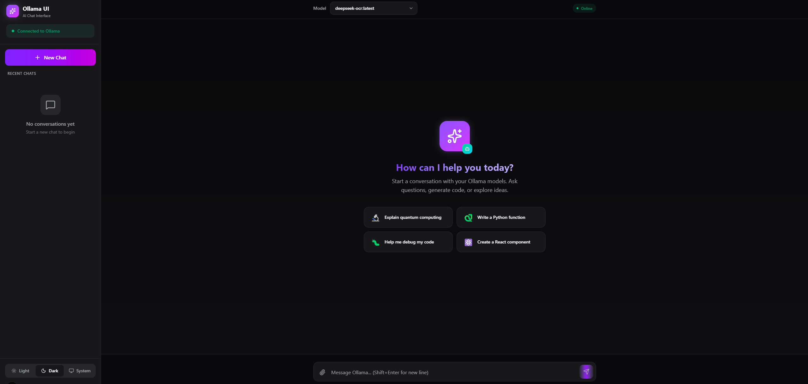

<div align="center">
  
  <h1>Ollama Web UI</h1>
  <p>A beautiful, modern web interface for chatting with Ollama models</p>
  
  
  
  
  
  
</div>

---

## 🖼️ Screenshots

<div align="center">
  <table>
    <tr>
      <td align="center"><strong>☀️ Light Mode</strong></td>
      <td align="center"><strong>🌙 Dark Mode</strong></td>
    </tr>
    <tr>
      <td></td>
      <td></td>
    </tr>
  </table>
</div>

---

## ✨ Features

### 💬 Chat Interface
- **Real-time streaming** - See responses as they're generated
- **Markdown support** - Full markdown rendering with syntax highlighting
- **Code blocks** - Copy code with one click, language detection
- **Conversation history** - Persistent chat history saved locally

### 🖼️ Vision Support
- **Image upload** - Click or drag & drop images
- **Multi-image support** - Upload up to 4 images at once
- **Vision model detection** - Automatically detects vision-capable models (LLaVA, Moondream, etc.)
- **Image analysis** - Ask questions about uploaded images

### 🎨 Beautiful Design
- **Light & Dark mode** - System-aware with manual toggle
- **Modern UI** - Clean, gradient-based design with smooth animations
- **Fully responsive** - Works perfectly on desktop, tablet, and mobile
- **Glass morphism** - Beautiful backdrop blur effects

### ⚙️ Configuration
- **Easy setup** - First-time setup wizard for Ollama URL
- **Environment variables** - Pre-configure URL via `NEXT_PUBLIC_OLLAMA_URL`
- **Model selection** - Quick model switching from the header
- **Connection status** - Real-time server connection indicator

### 🐳 Production Ready
- **Docker support** - Multi-stage Dockerfile for optimized builds
- **Docker Compose** - One-command deployment
- **Health checks** - Built-in container health monitoring
- **Standalone output** - Optimized Next.js standalone build

---

## 🚀 Quick Start

### Using Docker Compose (Recommended)

```bash
# Clone the repository
git clone https://github.com/yourusername/ollama-web-ui.git
cd ollama-web-ui

# Start the application
docker-compose up -d

# Or with a pre-configured Ollama URL (skips setup wizard)
OLLAMA_URL=https://your-ollama-server.com docker-compose up -d
```

The app will be available at `http://localhost:3000`

### Using Docker

```bash
# Build the image
docker build -t ollama-web-ui .

# Run with setup wizard
docker run -p 3000:3000 ollama-web-ui

# Run with pre-configured URL
docker run -p 3000:3000 -e NEXT_PUBLIC_OLLAMA_URL=http://localhost:11434 ollama-web-ui
```

### Development

```bash
# Install dependencies
npm install

# Run development server
npm run dev

# Build for production
npm run build

# Start production server
npm start
```

---

## 🔧 Environment Variables

| Variable | Description | Default |
|----------|-------------|---------|
| `NEXT_PUBLIC_OLLAMA_URL` | Ollama server URL (skips setup wizard if set) | - |
| `PORT` | Port to run the app on | `3000` |

---

## 📖 Connecting to Ollama

1. **Install Ollama** from [ollama.ai](https://ollama.ai)
2. **Start the server**: `ollama serve`
3. **Pull a model**: `ollama pull llama2` or `ollama pull llava` (for vision)
4. **Open the app** and enter your Ollama URL

### CORS Configuration

If running Ollama on a different machine, enable CORS:

```bash
OLLAMA_ORIGINS=* ollama serve
```

---

## 🛠️ Tech Stack

- **Framework**: [Next.js 16](https://nextjs.org/) with App Router
- **Language**: [TypeScript](https://www.typescriptlang.org/)
- **Styling**: [Tailwind CSS 4](https://tailwindcss.com/)
- **Icons**: [Lucide React](https://lucide.dev/)
- **Markdown**: [React Markdown](https://github.com/remarkjs/react-markdown) with GFM support

---

## 📄 License

This project is licensed under the MIT License - see the [LICENSE](LICENSE) file for details.

---

## 👨‍💻 Author

<div align="center">
  <a href="https://habsi.net">
    
  </a>
  <a href="https://github.com/khabsi">
    
  </a>
</div>

<div align="center">
  <br />
  <p>Built with ❤️ by <a href="https://habsi.net"><strong>Khamis Al Habsi</strong></a></p>
  <p>Senior Software Engineer | Full-Stack Developer | DevOps</p>
</div>

---

<div align="center">
  <sub>If you found this useful, please ⭐ the repository!</sub>
</div>
